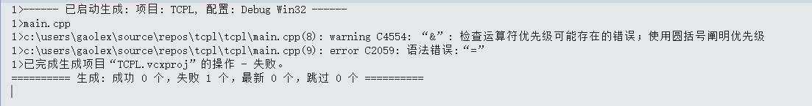

* 1 Rewrite the following `for`-statement as an equivalent `while-`statement:

```c++
    for (i=0; i!=max_length; i++)
        if (input_line[i] == '?')
            quest_count++;
```

Rewrite it to use a pointer as the controlled variable, that is, so that the test is of the form `∗p=='?'`. Rewrite it to use a range-`for` .

```c++
//use while
int i=0;
while(i!=max_length)
{
    if(input_line[i]=='?')
        quest_count++;
    i++;
}
//use pointer
for(auto p = input_line;*p!='\0';p++)
{
    if(*p=='?')
        quest_count++;
} 

```

---

* 2 See how your compiler reacts to these errors:

```c++
    void f(int a, int b)
    {
        if (a = 3) // ...
        if (a&077 == 0) // ...
        a := b+1;
    }
```
Devise more simple errors and see how the compiler reacts.

Error in VisualStudio2017 by MSVC


Error in centos7 by g++ 4.8.5
```bash
# gaolex @ cv in ~/TCPPPL-4th-Exercises/X.10 on git:master x [11:02:53] C:1
$ g++ 10-2.cpp
10-2.cpp: 在函数‘void f(int, int)’中:
10-2.cpp:9:8: 错误：expected primary-expression before ‘=’ token
    a : = b + 1;
        ^
```

---

* 3 What does the following example do?

```c++
    void send(int∗ to, int∗ from, int count)
        // Duff ’s device. Helpful comment deliberately deleted.
    {
        int n = (count+7)/8;
        switch (count%8) {
        case 0: do { ∗to++ = ∗from++;
        case 7: ∗to++ = ∗from++;
        case 6: ∗to++ = ∗from++;
        case 5: ∗to++ = ∗from++;
        case 4: ∗to++ = ∗from++;
        case 3: ∗to++ = ∗from++;
        case 2: ∗to++ = ∗from++;
        case 1: ∗to++ = ∗from++;
            } while (−−n>0);
        }
    }
```

Why would anyone write something like that? No, this is not recommended as good style.

```c++
int a[10]{ 0,1,2,3,4,5,6,7,8,9 };
int b[10]{ 10,11,12,13,14,15,16,17,18,19 };
send(a, b, 9);
//a {10, 11, 12, 13, 14, 15, 16, 17, 18, 9}	
//b { 10,11,12,13,14,15,16,17,18,19 }
```

---

* 4 Write a function `atoi(const char∗)` that takes a C-style string containing digits and returns the corresponding int . For example, `atoi("123")` is `123` . Modify `atoi()` to handle C++ octal and hexadecimal notation in addition to plain decimal numbers. Modify `atoi()` to handle the C++ character constant notation.

```c++
#include<iostream>
#include<string>

int atoi(const char* c)
{
	int r{};
	for (auto i = 0; *(c + i) != '\0'; i++)
	{
		r *= 10;
		r += *(c + i) - '0';
	}
	return r;
}

int atoi(int x)
{
	return x;
}

int atoi(const char c)
{
	return c - '0';
}

int main()
{
	int a{ 017 };
	int b{ 0x17 };
	int c{ 17 };
	const char *p = "123456789";
	const char d{ '1' };
	std::cout << a << std::endl;
	std::cout << atoi(a) << std::endl;
	std::cout << b << std::endl;
	std::cout << atoi(b) << std::endl;
	std::cout << c << std::endl;
	std::cout << atoi(c) << std::endl;
	std::cout << p << std::endl;
	std::cout << atoi(p) << std::endl;
	std::cout << d << std::endl;
	std::cout << atoi(d) << std::endl;
	return 0;
}
```

```bash
# gaolex @ cv in ~/TCPPPL-4th-Exercises/X.10 on git:master x [12:31:27] 
$ g++ 10-4.cpp -std=c++11

# gaolex @ cv in ~/TCPPPL-4th-Exercises/X.10 on git:master x [12:31:37] 
$ ./a.out                
15
15
23
23
17
17
123456789
123456789
1
1

```

---

* 5 Write a function `itoa(int i, char b[])` that creates a string representation of `i` in `b` and returns `b` .

```c++
#include <iostream>
#include <string>

using namespace std;

char * itoa(int i, char b[])
{
	int temp{i};
	int power{1};
	while (temp /= 10)
		power++;
	for (auto j = 0; j < power; j++)
	{
		int k = i % 10;
		b[power - 1 - j] = k+'0';
		i /= 10;
	}
	return b;
}

int main()
{
	int i{1234567890};
	char p[20]{};
	std::cout << itoa(i,p) << std::endl;
	return 0;
}
```

```bash
# gaolex @ cv in ~/TCPPPL-4th-Exercises/X.10 on git:master x [13:30:46] 
$ g++ 10-5.cpp -std=c++11

# gaolex @ cv in ~/TCPPPL-4th-Exercises/X.10 on git:master x [13:30:55] 
$ ./a.out                
1234567890
```

---

* 6 Modify `iota()` from the previous exercise to take an extra ‘‘string length’’ argument to make
overflow less likely.

similar to the above question

---

* 7 Write a program that strips comments out of a C++ program. That is, read from `cin` ,remove both `//` comments and `/∗ ∗/` comments, and write the result to `cout` . Do not worry about making the layout of the output look nice (that would be another, and much harder,exercise). Do not worry about incorrect programs. Beware of `//` , `/∗` , and `∗/` in comments, strings, and character constants.

```c++
#include <iostream>
#include <string>

using namespace std;

/*
there is some comments
*/

string& strip(string& s)
{
	while (s.find("//") or  s.find_first_of("/*"))
	{
		auto pos1 = s.find_first_of("//");
		if (pos1==std::string::npos)
			break;
		auto pos2 = s.find_first_of("\n", pos1);
		s.erase(pos1, pos2-pos1+1);
		auto pos3 = s.find_first_of("/*");
		if (pos3 == std::string::npos)
			break;
		auto pos4 = s.find_first_of("*/",pos3);
		s.erase(pos3, pos4 - pos3 + 1);
	}
	return s;
}

int main()
{
	string s{ };
	cin >> s;
	cout << strip(s) << endl;
	return 0;
}
```

---

* 8 Look at some programs to get an idea of the variety of indentation, naming, and commenting styles actually used.
