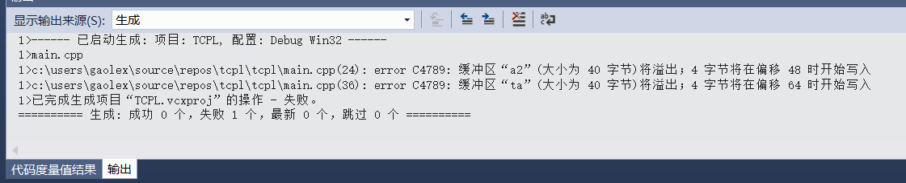

* 1 Write declarations for the following: a pointer to a character, an array of 10 integers, a reference to an array of 10 integers, a pointer to an array of character strings, a pointer to a pointer to a character, a constant integer, a pointer to a constant integer, and a constant pointer to an integer. Initialize each one.

```
char* c {};
int a[10] {};
int (&rarr)[10] = a;
int (*parr)[10] = &a;
char ** ppc{};
const int ci = 10;
const int* pci = &ci;
int const* cpi = &ci;
```

---

* 2 What, on your system, are the restrictions on the pointer types char∗ , int∗ , and void∗ ?For example, may an int∗ have an odd value? Hint: alignment.

the knowledge about alignment

---

* 3 Use an alias ( using ) to define the types unsigned char , const unsigned char , pointer to integer, pointer to pointer to char , pointer to array of char , array of 7 pointers to int , pointer to an array of 7 pointers to int , and array of 8 arrays of 7 pointers to int . 

``` c++
//alias to unsigned char
using uchar = unsigned char;
//alias to const unsigned char
using const_uchar = const unsigned char;
//alias to pointer to integer
using ptr_int = int*;
//alias to pointer to pointer to char
using ptr_ptr_char = char**;
//alias to pointer to array of char
using ptr_arr_char = char(*)[];
//alias to array of 7 pointers to int
using arr_7ptr_int = int *[7];
//alias to pointer to an array of 7 pointers to int
using ptr_arr_7ptr_int = int *(*)[7];
//alias to array of 8 arrays of 7 pointers to int
using arr_8arr_7ptr_int = int *[][8][7];
```

---

* 4 Given two char∗ s pointing into an array, find and output the number of characters between the two pointed-to characters (zero if they point to the same element).

``` c++
#include <iostream>

using namespace std;

int distanceBetweenCharPtr(char* s1,char* s2)
{
    return s2-s1;
}

int main()
{
    char s[] = {"hello"};
    char* s2 = &s[2];
    cout<<distanceBetweenCharPtr(s,s2)<<endl;//2
    cout<<distanceBetweenCharPtr(s2,s)<<endl;
    return 0;//-2
}
```

---

* 5 Given two int∗ s pointing into an array, find and output the number of int s between the two pointed-to int s (zero if they point to the same element).

``` c++
#include <iostream>

using namespace std;

int distanceBetweenCharPtr(int* s1,int* s2)
{
    return s2-s1;
}

int main()
{
    int s[] = {1,2,3,4,5,6};
    int* s2 = &s[5];
    cout<<distanceBetweenCharPtr(s,s2)<<endl;
    cout<<distanceBetweenCharPtr(s2,s)<<endl;
    return 0;
}
```

```bash
# gaolex @ cv in ~/TCPPPL-4th-Exercises/X.8 on git:master x [2:51:53] 
$ g++ 8-5.cpp -std=c++11

# gaolex @ cv in ~/TCPPPL-4th-Exercises/X.8 on git:master x [2:53:28] 
$ ./a.out               
5
-5
```

---

* 6 What happens when you read and write beyond the bounds of an array. Do a few exper-iments involving a global array of ints , a local array of ints, an array of ints allocated by new ,and a member array of ints. Try reading and writing just beyond the end and far beyond the end. Try the same for just before and far before the beginning. See what happens for different optimizer levels. Then try hard never to do out-of-range access by mistake.

```c++
#include <iostream>

using namespace std;

class testArray
{
public:
	int a6[10] = { 30,31,32,33,34,35,36,37,38,39 };
};

int a1[] = { 0,1,2,3,4,5,6,7,8,9 };

int main()
{
	int a2[] = { 10,11,12,13,14,15,16,17,18,19 };
	int *a3 = new int[10];//默认初始化：未初始化
	int *a4 = new int[10]();//初始化为0
	int *a5 = new int[10]{ 20,21,22,23,24,25,26,27,78,29 };//初始化
	testArray ta;
	*(a1 - 1) = 1;
	*(a1 + 11) = 1;

	*(a2 - 2) = 2;
	*(a2 + 12) = 2;

	*(a3 - 3) = 3;
	*(a3 + 13) = 3;

	*(a4 - 4) = 4;
	*(a4 + 14) = 4;

	*(a5 - 5) = 5;
	*(a5 + 15) = 5;

	*(ta.a6 - 6) = 6;
	*(ta.a6 + 16) = 6;
    
	delete[] a3;
	delete[] a4;
	delete[] a5;
	return 0;
}
```
**Nothing happend in Centos by g++ 4.8.5**
```bash
# gaolex @ cv in ~/TCPPPL-4th-Exercises/X.8 on git:master x [2:15:01] 
$ g++ 8-6.cpp -std=c++11

# gaolex @ cv in ~/TCPPPL-4th-Exercises/X.8 on git:master x [2:15:02] 
$ ./a.out     
```

**Error in VisualStudio2017 by MSVC**


---

* 7 Write a function that swaps (exchanges the values of) two integers. Use int∗ as the argument type. Write another swap function using int& as the argument type.

```c++
#include <iostream>

using namespace std;

void swap(int *a, int *b)
{
	cout << "swap by pointer" << endl;
	int c = *a;
	*a = *b;
	*b = c;
}

void swap(int &a, int &b)
{
	cout << "swap by references" << endl;
	int c = a;
	a = b;
	b = c;
}

int main()
{
	int i = 3, j = 4;
	cout << "i = " << i << "	j = " << j << endl;
	swap(&i, &j);
	cout << "i = " << i << "	j = " << j << endl;
	swap(i, j);
	cout << "i = " << i << "	j = " << j << endl;
	return 0;
}
```

```bash
# gaolex @ cv in ~/TCPPPL-4th-Exercises/X.8 on git:master x [2:38:54] 
$ g++ 8-7.cpp -std=c++11

# gaolex @ cv in ~/TCPPPL-4th-Exercises/X.8 on git:master x [2:38:59] 
$ ./a.out               
i = 3	j = 4
swap by pointer
i = 4	j = 3
swap by references
i = 3	j = 4
```

---

* 8 What is the size of the array str in the following example: char str[] = "a short string"; What is the length of the string "a short string" ?

```c++
#include <iostream>
#include <string>
using namespace std;


int main()
{
	char str[] = "a short string";
	string s = "a short string";
	cout << "size of char str[] = \"a short string\" is " << sizeof(str) << endl;
	cout << "length of string \"a short string\" is " << s.length() << endl;
	return 0;
}
```

```bash
# gaolex @ cv in ~/TCPPPL-4th-Exercises/X.8 on git:master x [2:39:01] 
$ g++ 8-8.cpp -std=c++11

# gaolex @ cv in ~/TCPPPL-4th-Exercises/X.8 on git:master x [2:51:48] 
$ ./a.out               
size of char str[] = "a short string" is 15
length of string "a short string" is 14
```
---

* 9 Define functions f(char) , g(char&) , and h(const char&) . Call them with the arguments 'a' , 49 , 3300 , c , uc , and sc , where c is a char , uc is an unsigned char , and sc is a signed char .Which calls are legal? Which calls cause the compiler to introduce a temporary variable?


---

* 10 Define an array of strings in which the strings contain the names of the months. Print those strings. Pass the array to a function that prints those strings.

```c++
#include <iostream>
#include <string>
using namespace std;

void print_months(string a[],int i = 12)
{
	for (auto j = 0; j < i; j++)
		cout << a[j] << endl;
	
}

int main()
{
	string months[]{ "January","February","March","April",
					"May","June","July","August","September",
					"October","November","December" };
	print_months(months);
	return 0;
}
```


```bash
# gaolex @ cv in ~/TCPPPL-4th-Exercises/X.8 on git:master x [3:08:40] C:127
$ g++ 8-10.cpp -std=c++11

# gaolex @ cv in ~/TCPPPL-4th-Exercises/X.8 on git:master x [3:08:45] 
$ ./a.out                
January
February
March
April
May
June
July
August
September
October
November
December

```

---

* 11 Read a sequence of words from input. Use Quit as a word that terminates the input. Print the words in the order they were entered. Don’t print a word twice. Modify the program to sort the words before printing them.

```c++
#include <iostream>
#include <string>
#include <vector>
#include <algorithm>

using namespace std;

int main()
{
	vector<string> vs;
	for (string s; cin >> s; )
		if (s != "quit" && find(vs.begin(),vs.end(),s)==vs.end())
			vs.push_back(s);
		else break;
	cout << "raw order：" << endl;
	for (auto i : vs)
		cout << "	" << i << endl;
	cout << "sorted order:" << endl;
	sort(vs.begin(), vs.end());
	for (auto i : vs)
		cout << "	" << i << endl;
	return 0;
}
```

```bash
# gaolex @ cv in ~/TCPPPL-4th-Exercises/X.8 on git:master x [3:08:46] 
$ g++ 8-11.cpp -std=c++11

# gaolex @ cv in ~/TCPPPL-4th-Exercises/X.8 on git:master x [4:31:36] 
$ ./a.out                
qwe
asd
zxc
quit
raw order：
	qwe
	asd
	zxc
sorted order:
	asd
	qwe
	zxc
```

---

* 12 Write a function that counts the number of occurrences of a pair of letters in a string and another that does the same in a zero-terminated array of char (a C-style string). For example, the pair "ab" appears twice in "xabaacbaxabb" .

```c++
int count_pairs(std::string str, std::string pair) {
	int count = 0;
	for (int i = 0; i != str.length() - 1; ++i)
		if (str.substr(i, 2) == pair)
			++count;
	return count;
}

int count_pairs(char* str, char* pair) {
	int count = 0;
	int i = 0;
	while (str[i + 1]) {
		if (str[i] == pair[0] && str[i + 1] == pair[1])
			++count;
		++i;
	}
	return count;
}
```

---

* 13 Run some tests to see if your compiler really generates equivalent code for iteration using pointers and iteration using indexing (§7.4.1). If different degrees of optimization can be requested, see if and how that affects the quality of the generated code.

```c++
//8-13-1.cpp
#include <iostream>

void f(char v[])
{
    for(int i=0;v[i]!=0;++i)
        std::cout<<v[i]<<std::endl;
}
```

```c++
//8-13-2.cpp
#include <iostream>
void f(char v[])
{
    for(char* p=v;*p!=0;++p)
        std::cout<<*p<<std::endl;
}
```

```bash
# gaolex @ cv in ~/TCPPPL-4th-Exercises/X.8 on git:master x [4:46:32] C:1
$ g++ -O1 -S 8-13-1.cpp

# gaolex @ cv in ~/TCPPPL-4th-Exercises/X.8 on git:master x [4:46:41] 
$ g++ -O1 -S 8-13-2.cpp

# gaolex @ cv in ~/TCPPPL-4th-Exercises/X.8 on git:master x [4:47:20] 
$ diff 8-13-1.s 8-13-2.s 
1c1
< 	.file	"8-13-1.cpp"
---
> 	.file	"8-13-2.cpp"
8,10d7
< 	pushq	%r13
< 	.cfi_def_cfa_offset 16
< 	.cfi_offset 13, -16
12,13c9,10
< 	.cfi_def_cfa_offset 24
< 	.cfi_offset 12, -24
---
> 	.cfi_def_cfa_offset 16
> 	.cfi_offset 12, -16
15,16c12,13
< 	.cfi_def_cfa_offset 32
< 	.cfi_offset 6, -32
---
> 	.cfi_def_cfa_offset 24
> 	.cfi_offset 6, -24
18,22c15,19
< 	.cfi_def_cfa_offset 40
< 	.cfi_offset 3, -40
< 	subq	$24, %rsp
< 	.cfi_def_cfa_offset 64
< 	movq	%rdi, %r13
---
> 	.cfi_def_cfa_offset 32
> 	.cfi_offset 3, -32
> 	subq	$16, %rsp
> 	.cfi_def_cfa_offset 48
> 	movq	%rdi, %r12
26d22
< 	movl	$0, %r12d
58,60c54,55
< 	addl	$1, %r12d
< 	movslq	%r12d, %rax
< 	movzbl	0(%r13,%rax), %eax
---
> 	addq	$1, %r12
> 	movzbl	(%r12), %eax
64,66c59
< 	addq	$24, %rsp
< 	.cfi_def_cfa_offset 40
< 	popq	%rbx
---
> 	addq	$16, %rsp
68c61
< 	popq	%rbp
---
> 	popq	%rbx
70c63
< 	popq	%r12
---
> 	popq	%rbp
72c65
< 	popq	%r13
---
> 	popq	%r12

```